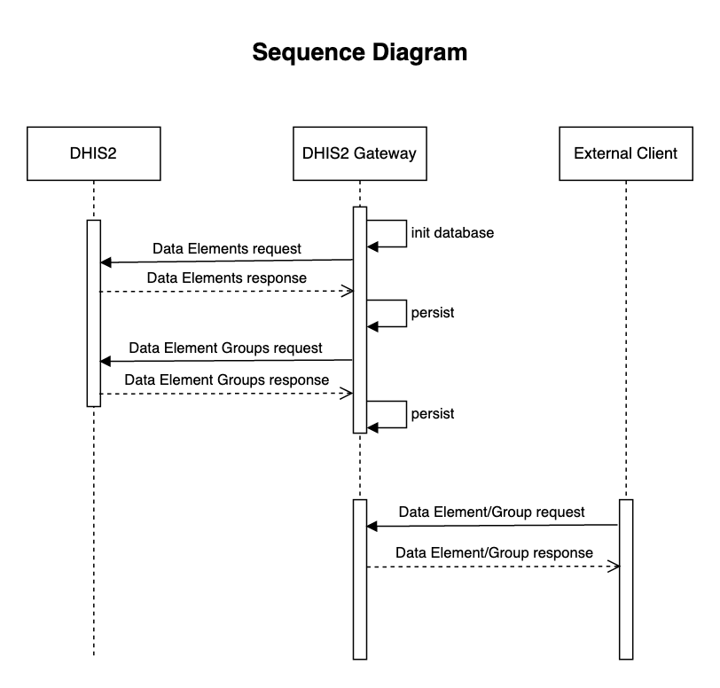

# dhis2-web-api-gateway

## Overview
- Gateway service for the DHIS2 Web API  
- On startup, 2 calls are made to DHIS2 to get both:
  - Data Elements
  - Date Element Groups
- The initialisation of the database (in-memory H2) on startup is configurable through the app properties
- 2 endpoints are exposed (returning JSON or XML)
  - `/api/dataElements`
  - `/api/dataElementGroups`
- When the Gateway API receives a request for data:
  - a check is performed to see if the data is already present in the DB
  - if the data is present (from startup initialisation flow) then it is returned to the client
    - that endpoint call is now cached for future calls (also configurable through app properties)
  - if the data is not present, then calls are made to DHIS2 to retrieve the required data to populate the DB

  

## Design decisions and notes
### Caching
Caching was implemented for both exposed API endpoints (Data Elements & Data Element Groups). An initial eviction interval of 10 minutes (configurable) was set. This value would be driven by how often the data retrieved might change. We could also implement an endpoint to trigger a cache eviction on demand.

### Data formats
DTOs for both DHIS2 data and the service's own API responses were implemented. Having DTOs for each separate use case allows great flexibility while decoupling formats from each other.  
Entities for each data type were implemented.

### Mapping
Simple Java Functions were used to map between DTO <-> Entities and vice versa. These are easily testable and read well. Other options for mapping could be MapStruct for example.

### Reactive handling
Incoming requests on the exposed endpoints use async processing. The outgoing calls to DHIS2 were implemented as synchronous, this was due to the many-to-many relationship between Data Elements and Data Elements groups and the implementation in Hibernate. Data Elements 'own' the relationship so this data needs to be persisted in the DB first. They were previously implemented as async calls but race conditions were observed (Data Element Groups being persisted and no existing related Data Element found) 

### Security
Spring Security was implemented with a simple username & password. These are located in the application properties and are required for calls to the API.

## Testing
Most of the code is covered by unit tests, using Mockito where appropriate. Some integration tests were also implemented for the full end-to-end flow:
- incoming request
- mocking the DHIS2 response
- asserting the json response  

An integration test was also implemented using an in-memory H2 DB testing the DB init service.

Unit tests can be run using the `mvn test` command.  
Integration tests are run during the `verify` phase.  
Spring Rest Docs are produced during the `package` phase and sample request/responses are produced. This file is located at `<project-root>/target/generated-docs/api-guide.html`